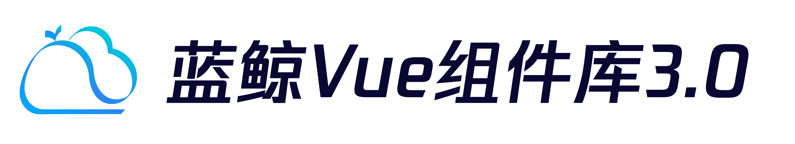

---

[](https://github.com/TencentBlueKing/bkui-vue3/blob/master/LICENSE.txt) [](https://www.npmjs.com/package/bkui-vue) <!--[](https://npmcharts.com/compare/bkui-vue?minimal=true)--> [](https://github.com/TencentBlueKing/bkui-vue3/pulls)

[English](README_EN.md) | 简体中文

# bkui-vue3

基于蓝鲸 Magicbox 和 Vue3 的前端组件库

## Project setup
```
yarn install
```

### Compiles and hot-reloads for development
```
yarn dev
```

### Compiles and minifies for production
```
yarn build
```

### Run your unit tests
```
yarn test
```

### Lints and fixes files
```
yarn lint
```

#### 如何新增使用一个 icon

* 将你的 svg 保存到 `packages/icon/src/svg` 目录下
* 重命名为你的 icon 使用的具有识别的英文名称
* 执行命令 `yarn generate:icon`
* 在组件中使用类似语法 `import { HelpFill } from '@bkui-vue/icon/';` 引用即可


## 如何开始

想要贡献代码，建议请先参照已有的特性文档和开发环境构建文档。可以运行 `npm run plop` 输入组件名生成新组件模板

## GIT 提交规范

为了规范 commit-msg 格式，建议使用 `yarn cz` 自动生成 commit-msg, 不同的提交标记以规范化区分提交内容：

```
<标记>(<组件名称>): [提交的概要注释] issue #[123]
// 空一行
<本次变更详细说明>
// 空一行
<footer>
```

示例:

```shell
chore(common): 梳理组件库开发流程

affects: bkui-vue, @bkui-vue/button, @bkui-vue/checkbox, @bkui-vue/input, @bkui-vue/radio

允许单个组件执行 jest 任务
添加 husky 提交流程较验
添加 chanelog 自动生成机制

ISSUES CLOSED: #1
```

### 标记说明:

| 标记           | 说明                                        |
| -------------- | ------------------------------------------- |
| feature/feat   | 新功能开发                                  |
| bug/fix/bugfix | bug 修复                                     |
| refactor/perf  | 重构代码/优化配置&参数/优化逻辑及功能       |
| test           | 添加单元测试用例相关                        |
| docs           | 添加文档                                    |
| info           | 添加注释类信息                              |
| format         | 不修改业务逻辑下，仅做代码规范的格式化      |
| merge          | 仅做分支合并同步                            |
| depend         | 对工程的依赖进行增删改                      |
| chore          | 构建脚本、任务等相关代码                    |
| del            | 删除可能仍然有人用到的功能、API 等破坏性动作 |
