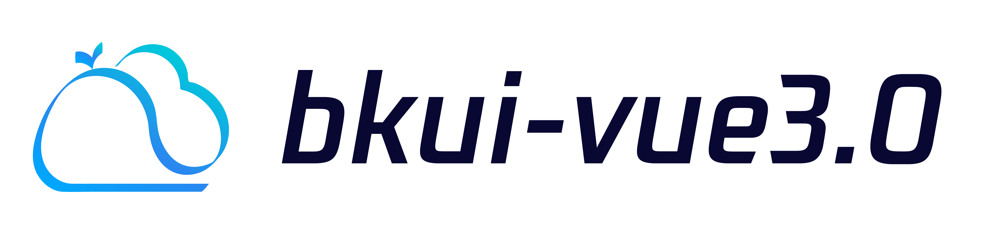

---

[](https://github.com/TencentBlueKing/bkui-vue3/blob/master/LICENSE.txt) [](https://www.npmjs.com/package/bkui-vue) <!--[](https://npmcharts.com/compare/bkui-vue?minimal=true)--> [](https://github.com/TencentBlueKing/bkui-vue3/pulls)

English | [简体中文](README.md)

# bkui-vue3

A UI library base on BlueKing Magicbox and Vue3

## Project setup
```
yarn install
```

### Compiles and hot-reloads for development
```
yarn dev
```

### Compiles and minifies for production
```
yarn build
```

### Run your unit tests
```
yarn test
```

### Lints and fixes files
```
yarn lint
```

#### How to add an icon

* Save your svg to the `packages/icon/src/svg` directory
* Rename to a recognizable English name used by your icon
* Execute the command `yarn generate:icon`
* Use similar syntax `import { HelpFill } from '@bkui-vue/icon/';` in the component to reference


## How to get started

If you want to contribute code, it is recommended to refer to the existing feature documentation and development environment build documentation first. You can run `npm run plop` and enter the component name to generate a new component template

## GIT commit specification

In order to standardize the commit-msg format, it is recommended to use `yarn cz` to automatically generate commit-msg, with different commit markers to standardize and differentiate the commit content:

```
<tag>(<component name>): [submitted summary notes] issue #[123]
// Skip a line
<details of this change>
// Skip a line
<footer>
```

example:

```shell
chore(common): Standard component library development process

affects: bkui-vue, @bkui-vue/button, @bkui-vue/checkbox, @bkui-vue/input, @bkui-vue/radio

Allow a single component to execute jest tasks
Add husky submission process verification
Add chanelog automatic generation mechanism

ISSUES CLOSED: #1
```

### tag description:

| tag           | description                                        |
| -------------- | ------------------------------------------- |
| feature/feat   | new feature development                                  |
| bug/fix/bugfix | bug fix                                     |
| refactor/perf  | refactor code/optimize configuration & parameters/optimize logic and functions       |
| test           | add unit test case related                        |
| docs           | add document                              |
| info           | add comment information              |
| format         | Without modifying the business logic, only format the code specification      |
| merge          | only do branch merge sync                            |
| depend         | add, delete and modify the dependencies of the project                      |
| chore          | build scripts, tasks and other related code                    |
| del            | remove disruptive actions such as features, APIs, etc. that may still be used |
